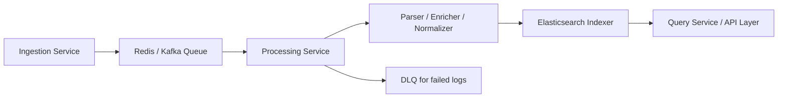

# 🌟 StreamLens: Real-Time Log Processing Platform

[](https://github.com/khushal075/streamlens/actions/workflows/ci.yml)
[](https://codecov.io/gh/khushal075/streamlens)
[](https://hub.docker.com/r/khushal/streamlens-processing)
[](LICENSE)

---

## 🔹 Overview

StreamLens is a **microservices-based log processing platform** built to ingest, process, enrich, and query logs in **real-time**. It leverages **Redis, Kafka, and Elasticsearch** for high-throughput, reliable, and scalable log processing.

**Services:**

| Service                | Responsibility                                                             |
| ---------------------- | -------------------------------------------------------------------------- |
| **Ingestion Service**  | Collect logs from APIs, files, or external sources and push to Redis/Kafka |
| **Processing Service** | Consume logs, parse, normalize, enrich, and index into Elasticsearch       |
| **Query Service**      | Provide search and analytics APIs over indexed logs                        |
| **Common Library**     | Shared utilities, configs, Kafka clients, and schemas                      |

---

## ⚡ Features

* High-throughput **async processing** with Python + asyncio
* Supports **Redis queue** and **Kafka topics**
* **JSON & text parsing**, enrichment, and normalization
* Indexing into **Elasticsearch** for fast queries
* **Dead-letter queue** (DLQ) for failed logs
* **Multi-tenant support**
* **Monitoring & metrics** via Prometheus + Grafana
* **Scalable** microservices deployable via Docker or Kubernetes

---

## 🏗 Architecture



---

## 📦 Getting Started

### 1️⃣ Clone Repository

```bash
git clone https://github.com/khushal075/streamlens.git
cd streamlens
```

### 2️⃣ Start Dependencies

```bash
docker-compose -f infra/docker-compose.yml up -d redis kafka elasticsearch
```

### 3️⃣ Install Python Dependencies

For each service:

```bash
cd ingestion-service
poetry install
# or
python -m venv .venv
source .venv/bin/activate
pip install -r requirements.txt
```

Repeat for `processing-service` and `query-service`.

---

## 🚀 Running Services

**Ingestion Service:**

```bash
cd ingestion-service
uvicorn app.main:app --host 0.0.0.0 --port 8000 --reload
```

**Processing Service:**

```bash
cd processing-service
uvicorn app.main:app --host 0.0.0.0 --port 8100 --reload
```

**Query Service:**

```bash
cd query-service
uvicorn app.main:app --host 0.0.0.0 --port 8200 --reload
```

---

## 🛠 Testing & Logs

**Generate Sample Logs:**

```bash
python scripts/generate_logs.py --count 1000
```

**Check Redis Queue Length:**

```bash
docker exec -it streamlens-redis redis-cli LLEN log_queue
```

**Consume Kafka Topic Logs:**

```bash
docker exec -it streamlens-kafka kafka-console-consumer \
  --bootstrap-server kafka:9092 \
  --topic logs \
  --from-beginning
```

**Query Logs via API:**

```bash
curl -X GET "http://localhost:8200/search?query=error&limit=10"
```

---

## 📂 Folder Structure

```
streamlens/
├── common/             # Shared configs, utils, Kafka clients
├── infra/              # Docker/K8s, Prometheus, Grafana, Elasticsearch configs
├── ingestion-service/  # Log ingestion microservice
├── processing-service/ # Log processing microservice
├── query-service/      # Query & API microservice
├── scripts/            # Utilities: log generator, setup, load test
└── docs/               # Architecture & documentation
```

---

## 🌟 GitHub Portfolio Highlights

* **Microservices Architecture:** Ingestion, Processing, and Query decoupled
* **Async & High Throughput:** Parallel processing with bulk Elasticsearch indexing
* **DLQ & Reliability:** Ensure no logs are lost
* **Real-Time Metrics:** Prometheus + Grafana dashboards
* **Scalable:** Each service can scale independently
* **Shared Library:** `common/` for reusable utilities, configs, and Kafka clients

**Screenshots / GIFs:**


---

## 💡 Production Tips

* Scale multiple processing-service instances to prevent queue backlog
* Monitor Redis/Kafka queue lengths
* Enable Elasticsearch **bulk indexing**
* Use DLQ to replay failed messages
* Use async parsing/enrichment for better parallelism
* Deploy via **Kubernetes** for production-grade reliability

---

## 📚 References

* [FastAPI Docs](https://fastapi.tiangolo.com/)
* [Redis Docs](https://redis.io/documentation)
* [Elasticsearch Docs](https://www.elastic.co/guide/en/elasticsearch/reference/current/index.html)
* [aiokafka](https://aiokafka.readthedocs.io/)
* [Asyncio](https://docs.python.org/3/library/asyncio.html)

---

This README makes your repo **portfolio-ready**:

* Shows **microservices architecture**
* Highlights your **async, scalable, reliable system**
* Includes **commands, screenshots, and demo flow** for recruiters or peers

---