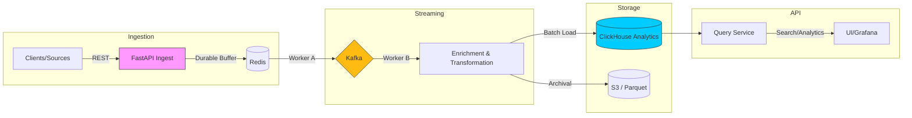

# 🌟 StreamLens: Distributed Real-Time Log Observability Platform

[](https://github.com/khushal075/streamlens/actions/workflows/ingestion-ci.yml)
[](https://www.python.org/downloads/)
[](LICENSE)
[](docs/architecture.md)

**StreamLens** is a high-performance, multi-tenant log processing ecosystem built to ingest, transform, and analyze massive volumes of data in real-time. It leverages a **Decoupled Buffer Architecture** (Redis + Kafka) to ensure zero data loss and ultra-low latency.

---

## 🏗 System Landscape

StreamLens is a monorepo consisting of specialized microservices, each designed for independent scalability and fault tolerance.

| Service | Primary Stack | Core Responsibility |
| :--- | :--- | :--- |
| [**Ingestion**](./ingestion-service) | FastAPI, Redis, Kafka | Entry point for raw logs; durable write-ahead buffering. |
| [**Processing**](./processing-service) | Kafka, Python AsyncIO | Enrichment, normalization, and Strategy-based parsing. |
| [**Query**](./query-service) | FastAPI, ClickHouse | High-speed analytical queries and log retrieval. |
| [**Common**](./common) | Poetry, Pydantic | Shared schemas, Kafka factories, and core utilities. |

---

## ⚡ High-Level Architecture

StreamLens utilizes a **Reliable Relay** model. Data flows from ephemeral high-speed buffers (Redis) to persistent event streams (Kafka) before reaching columnar analytical storage (ClickHouse).



---

## 🚀 Key Features

* **Multi-Tiered Buffering:** Uses Redis for instant `202 Accepted` responses and Kafka for long-term stream reliability.
* **Analytical Power:** Powered by **ClickHouse** for sub-second queries over billions of log rows.
* **Cold Storage Archival:** Automated conversion of logs to **Snappy-compressed Parquet** files for cost-effective S3 storage.
* **Advanced Design Patterns:** Implements **Strategy Pattern** for log parsing and **Observer Pattern** for worker coordination.
* **Quality First:** 80%+ Test Coverage gate and automated CI/CD pipelines for every service.
* **Cloud Native:** Fully containerized and optimized for **Kubernetes** with HPA (Horizontal Pod Autoscaling) support.

---

## 🛠 Tech Stack

* **Language:** Python 3.11+ (AsyncIO)
* **API:** FastAPI
* **Messaging:** Apache Kafka, Redis
* **Databases:** ClickHouse (OLAP), Redis (Cache/Buffer)
* **DevOps:** Docker, Kubernetes, GitHub Actions
* **Quality:** Pytest, Flake8, Poetry

---

## 📂 Project Navigation

```text
streamlens/
├── common/              # 🏛 Shared logic, Kafka clients, & Pydantic models
├── ingestion-service/   # 📥 High-throughput log entry point
├── processing-service/  # ⚙️ Real-time transformation & enrichment
├── query-service/       # 🔍 Analytical API & Search layer
├── infra/               # 🐳 Docker Compose & Kubernetes manifests
├── docs/                # 📖 Deep-dive Design Docs & Architecture
└── scripts/             # 🛠 Load generators & automation tools
```

---

## 🏁 Getting Started

### 1. Requirements
* Docker & Docker Compose
* Python 3.11+
* Poetry

### 2. Spin up Infrastructure
```bash
docker-compose -f infra/docker-compose.yml up -d
```
*Starts Redis, Kafka, ClickHouse, and Zookeeper.*

### 3. Run a Service
Each service is a self-contained Poetry project.
```bash
cd ingestion-service
poetry install
poetry run uvicorn app.main:app --port 8000
```

---

## 📊 Monitoring & Insights
StreamLens includes out-of-the-box monitoring:
* **Prometheus:** Metrics collection for worker throughput and Kafka lag.
* **Grafana:** Pre-built dashboards for visualizing ingestion rates and error frequencies.
* **Health Checks:** Every service exposes a `/health` endpoint for Kubernetes liveness/readiness probes.

---

## 💡 Engineering Highlights

* **Scalability:** Services are stateless. Scaling the `processing-service` to 10 pods instantly increases throughput across Kafka partitions.
* **Fault Tolerance:** If ClickHouse goes offline, Kafka retains data for 7 days (configurable), allowing the system to "catch up" without data loss.
* **Efficiency:** Threaded Regex parsing handles CPU-bound tasks without blocking the AsyncIO event loop.

---

## 📚 Documentation
For detailed service-level designs, please refer to the [Internal Documentation Hub](./docs/architecture.md).

---
**License:** [MIT](./LICENSE) | **Author:** [khushal075](https://github.com/khushal075)