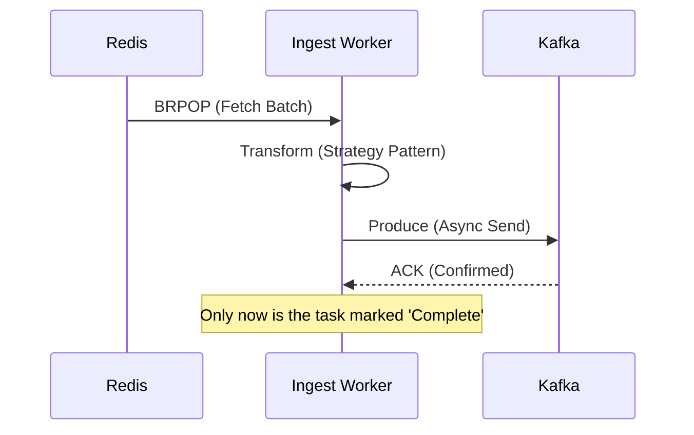

# 📖 Ingestion Service: Technical Design Document

This document outlines the architectural decisions, data flow, and reliability patterns of the **StreamLens Ingestion Service**. For local setup and execution instructions, refer to the [ingestion-service README](../ingestion-service/README.md).

---

## 🎯 Design Goals
The Ingestion Service is engineered to meet three core requirements:
1.  **High Availability**: The API must remain responsive even if downstream storage is slow.
2.  **Schema Flexibility**: Support for diverse log formats (K8s, Syslog, JSON) via a pluggable strategy.
3.  **Durability**: Zero data loss during transient network partitions or service restarts.

---

## 🏗 Detailed Architecture

StreamLens utilizes a **Multi-Stage Relay** to isolate concerns and manage backpressure.

### 1. The Durable Buffer (Movement A)
When a log batch arrives, the FastAPI layer performs minimal validation (schema check via Pydantic) and immediately serializes the payload into a **Redis List**.
* **Pattern**: Producer-Consumer.
* **Benefit**: This decouples the HTTP request/response cycle from the heavy lifting of Regex parsing and Kafka production. If Kafka latency spikes, the Redis buffer grows, but the API continues to accept logs at wire speed.

### 2. The Enrichment Engine (Movement B)
The `KafkaWorker` acts as the primary orchestrator. It pulls raw data from Redis and initiates the **Enrichment Pipeline**.

#### Strategy Pattern Implementation
We use a **Strategy Pattern** to handle varied log sources. This allows us to keep the worker code "Clean" while scaling the parsing logic.

| Strategy | Detection Logic | Transformation |
| :--- | :--- | :--- |
| `K8sProcessor` | Checks for `kubernetes` metadata | Extracts Pod ID, Namespace, and Container Name |
| `DockerProcessor` | Matches standard Docker JSON | Parses `stream`, `attr`, and `time` |
| `RegexProcessor` | Fallback for Unstructured Text | Applies generic Named Capture Groups |

---

## 🛡 Reliability & Fault Tolerance

### Reliable Relay Pattern
We ensure **At-Least-Once Delivery** by coordinating acknowledgments between three systems:

### Failure Scenario Handling
| Component Failure | Impact | Mitigation Strategy |
| :--- | :--- | :--- |
| **Kafka Down** | Workers cannot "Produce" | Workers pause `BRPOP` from Redis. Data accumulates in Redis until Kafka returns. |
| **Redis Down** | API cannot "Buffer" | API returns `503 Service Unavailable`. Upstream Load Balancers should reroute or retry. |
| **Worker Crash** | Processing stops | Kubernetes `ReplicaSet` restarts the pod. Since data is persistent in Redis, the new pod resumes exactly where the last one stopped. |

---

## 📈 Scaling Strategy

### Horizontal Scaling
* **API Layer**: Scaled via Kubernetes HPA based on **CPU/Request Count**.
* **Worker Layer**: Scaled based on **Redis Queue Depth**. If the queue exceeds 10,000 items, more workers are spun up to drain it.

### Vertical Scaling (Performance Tuning)
* **ThreadPoolExecutor**: Since Regex parsing is CPU-bound, we tune the `max_workers` in the thread pool to match the number of CPU cores available to the container.
* **Batching**: We aggregate 500–1,000 logs into a single Kafka produce request to reduce network overhead.

---

## 🔐 Multi-tenancy Design
StreamLens is a "Shared Infrastructure" model:
1.  **Identification**: `tenant_id` is extracted from the `X-Tenant-ID` header.
2.  **Tagging**: The `tenant_id` is baked into the final Kafka message.
3.  **Partitioning**: (Optional/Planned) Logs can be routed to Kafka partitions based on `tenant_id` to ensure one "heavy" tenant doesn't delay others (Head-of-Line blocking).

---

## 🧪 Testing Methodology
To maintain the **81% Coverage** gate:
* **Integration Tests**: We use `TestClient` to simulate full API-to-Redis flows.
* **Mocking**: External dependencies (aiokafka, redis-py) are mocked to ensure tests run in <10 seconds in the CI environment.
* **Stress Testing**: Simulated with 10k concurrent requests to verify the Redis buffer doesn't overflow memory limits.

---
**Next in the Docs:** [Processing Layer Design](./processing.md) | [Scaling Strategies](./scaling_strategy.md)