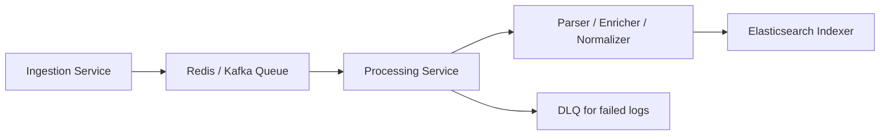
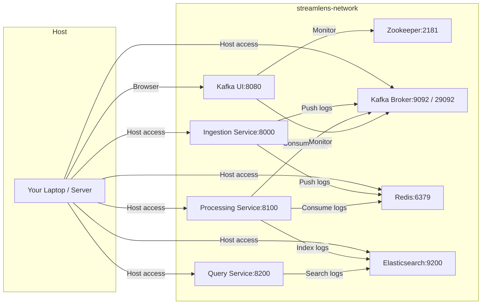

# 🟢 StreamLens Processing Service

StreamLens **Processing Service** consumes logs from the ingestion queue (Redis/Kafka), performs **enrichment, parsing, normalization**, and indexes logs into **Elasticsearch** for fast querying.

---

## ⚡ Features

* Consume logs from Redis queue or Kafka topics
* Supports JSON and text log parsing
* Enrichment and normalization of logs for structured storage
* Index logs into Elasticsearch
* Extensible **DLQ** (Dead Letter Queue) for failed messages
* Multi-tenant support
* Async processing for high throughput

---

## 🏗 Architecture



**Components:**

* **Consumers**: Pull logs from Redis/Kafka
* **Parser**: JSON/Text parsing for structured fields
* **Enricher**: Adds metadata or transformations
* **Normalizer**: Converts logs into standard schema
* **Indexer**: Writes logs to Elasticsearch
* **DLQ**: Stores failed logs for reprocessing

---

## 📦 Installation

1. **Clone Repository**

```bash
git clone https://github.com/khushal075/streamlens.git
cd streamlens/processing-service
```

2. **Install Dependencies**

```bash
# Using Poetry
poetry install

# Or using pip + venv
python -m venv .venv
source .venv/bin/activate
pip install -r requirements.txt
```

3. **Start Dependencies**

```bash
docker-compose -f ../infra/docker-compose.yml up -d redis kafka elasticsearch
```

---

## 🚀 Running the Service

```bash
uvicorn app.main:app --host 0.0.0.0 --port 8100 --reload
```

* Logs will be consumed from Redis queue (`log_queue`) or Kafka topics.
* Processed logs will be indexed into Elasticsearch.

---

## 📝 API Usage (Optional)

Currently, processing-service is worker-based. Optional endpoints:

* **Health check**: `/health`
* **Queue status**: `/queue-status`

---

## 🔧 Queue / Consumer Configuration

**Redis:**

```bash
docker exec -it streamlens-redis redis-cli
127.0.0.1:6379> LLEN log_queue
(integer) 10
```

**Kafka:**

`app/consumers/kafka_consumer.py`:

```python
from aiokafka import AIOKafkaConsumer

consumer = AIOKafkaConsumer(
    "logs_topic",
    bootstrap_servers="kafka:9092",
    group_id="processing-service"
)
```

> Use `host.docker.internal:29092` for host-based Kafka clients on Mac/Windows.

---

## 🛠 Folder Structure

```
processing-service/
├── app/
│   ├── api/          # Optional endpoints
│   ├── consumers/    # Redis/Kafka consumers
│   ├── core/         # Config
│   ├── dlq/          # Dead-letter queue producer
│   ├── enrichment/   # Log enrichment logic
│   ├── indexer/      # Elasticsearch indexing
│   ├── parser/       # JSON/Text parsers
│   ├── queue/        # Queue abstractions
│   ├── schema/       # Normalization schemas
│   ├── services/     # Additional processing services
│   └── workers/      # Background workers
├── Dockerfile
├── pyproject.toml
├── tests/
└── uv.lock
```

---

## ⚡ StreamLens Network & Ports



**Ports Summary:**

| Service            | Container Port | Host Port | Notes                            |
| ------------------ | -------------- | --------- | -------------------------------- |
| Zookeeper          | 2181           | 2181      | Kafka coordination               |
| Kafka Broker       | 9092           | 9092      | Internal Docker network          |
| Kafka Broker       | 29092          | 29092     | Host-mapped, local clients       |
| Redis              | 6379           | 6379      | Log queue                        |
| Elasticsearch      | 9200           | 9200      | Indexing & queries               |
| Ingestion Service  | 8000           | 8000      | REST API to push logs            |
| Processing Service | 8100           | 8100      | Async consumer / worker          |
| Query Service      | 8200           | 8200      | REST API for log search          |
| Kafka UI           | 8080           | 8080      | Monitor Kafka topics & consumers |

---

## ⚡ Production Tips

* Run multiple processing-service instances to scale consumers.
* Monitor queue length to prevent backlog.
* Use DLQ to store failed logs for replay.
* Enable Elasticsearch bulk indexing for high throughput.
* Use async parsing and enrichment for parallel processing.

---

## 📦 Docker Support

```bash
# Build
docker build -t streamlens-processing .

# Run
docker run -p 8100:8100 --network streamlens-network streamlens-processing
```

Or use docker-compose:

```yaml
services:
  processing-service:
    build: ./processing-service
    depends_on:
      - redis
      - kafka
      - elasticsearch
    ports:
      - "8100:8100"
```

---

## ✅ Next Steps

* Integrate fully with ingestion-service and Kafka pipeline
* Implement monitoring dashboards for queue and index metrics
* Extend parser and enricher modules for more log formats

---

## 💡 References

* [FastAPI Docs](https://fastapi.tiangolo.com/)
* [Redis Docs](https://redis.io/)
* [Elasticsearch Docs](https://www.elastic.co/guide/en/elasticsearch/reference/current/index.html)
* [Asyncio](https://docs.python.org/3/library/asyncio.html)
* [aiokafka](https://aiokafka.readthedocs.io/)

---
